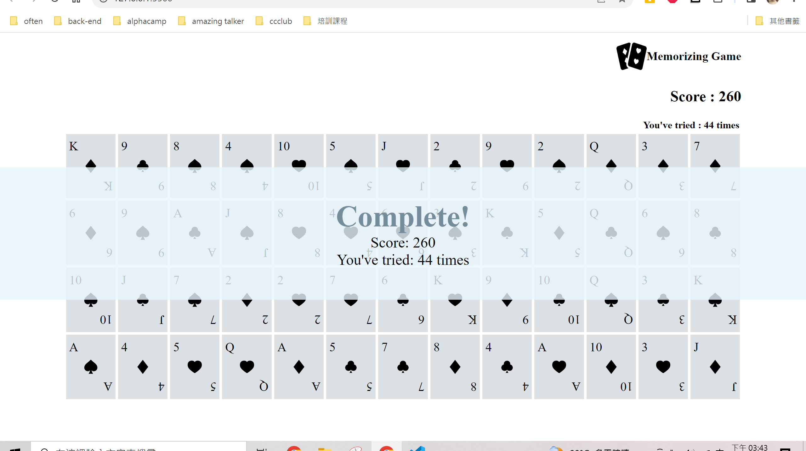

# 🃏 Memorizing Game

A web-based memory card matching game built using **Flask**, **JavaScript**, **HTML/CSS**, and **SQLite**.

## 📸 Project Screenshot



## 🎮 Game Rules

- The game uses a standard **52-card deck** (spades, hearts, diamonds, clubs; each from 1 to 13).
- All cards are laid **face down** at the start of the game.
- Players can flip **two cards at a time**:
  - ✅ If the numbers match (e.g., 7♦ and 7♠), they stay face up.
  - ❌ If not, they flip back down.
- Each correct match scores **10 points**.
- The goal is to match all **26 pairs** for a total of **260 points**.

## 💡 Features

- 🔐 User **registration**, **login**, and **logout**
- 📊 Individual player score tracking using **SQLite**
- 🎲 Full game logic written in **JavaScript**
- 🧠 Real-time score and attempt counter
- 🖼️ Responsive frontend interface
- 🔄 Session handling to persist login status

## 🗂️ Project Structure
project/
├── static/
│ ├── app.js # Game logic
│ └── style/
│ └── style.css # Styling
├── templates/
│ ├── index.html # Game page
│ └── (layout.html) # (Optional base template)
├── database.db # SQLite database (auto-created)
├── app.py # Flask backend
└── README.md # Project documentation


## ⚙️ Tech Stack

- **Frontend:** HTML, CSS, JavaScript
- **Backend:** Flask (Python)
- **Database:** SQLite
- **Session/Auth:** Flask session
- **Hosting:** Local Flask server

## 🚀 Getting Started

### 1. Install Flask

```bash
pip install flask
```

### 2. Run the app
```bash
python app.py
```

### 3. Open in browser
Visit: http://127.0.0.1:5000

### 4. Register & Play
Register a new account


## Log in to start the game


## 🙋 Author
Created by Rachel Tsai
Based on the CS50 Web Programming course.


